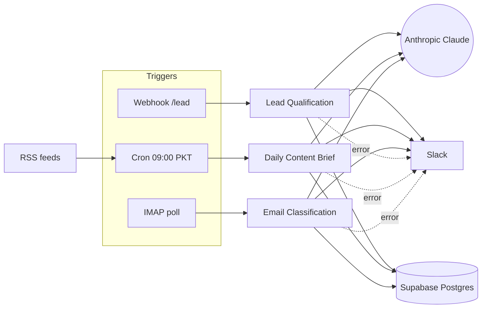

# AutoStream

A portfolio reference for what production n8n + Claude work looks like when shipped, not prototyped — three workflows, every LLM call logged, every webhook signed, every output validated.

> Live on Railway (30-day demo). Source open.
> Demo: [Loom — coming soon](LOOM_URL_PLACEHOLDER)


---

## TL;DR

AutoStream is a reference implementation of three high-leverage n8n workflows that small teams build over and over, badly:

1. **Lead Qualification** — score inbound leads with Claude, alert sales in Slack, log to Postgres.
2. **Daily Content Brief** — pull RSS at 9 AM, distill with Claude, post to Slack, archive to Postgres.
3. **Email Classification** — poll inbox via IMAP, categorize with Claude, route to the right Slack channel.

What makes this different from a tutorial:

- Every LLM call is observable — input, output, duration, tokens, cost, all in Supabase.
- Zod-validated outputs — no silent prompt drift; malformed responses fail loudly.
- Bounded retry (max 2 attempts) — no runaway loops, no cost blowouts.
- HMAC-verified webhooks — no spoofed triggers.
- Single-author git history — clean attribution, conventional commits, no AI footprints.

Built for the founder or marketing operator who needs production automation, not toys.

---

## Demo

| Workflow | Trigger | Latency | Cost per run |
|---|---|---|---|
| Lead Qualification | webhook | ~2s | ~$0.001 |
| Daily Content Brief | cron 09:00 PKT | ~15s | ~$0.01 |
| Email Classification | IMAP poll 5 min | ~3s | ~$0.001 |


---

## The Problem

Most n8n workflows in the wild fail one of these tests:

- LLM outputs aren't validated → silent corruption downstream.
- Retries aren't bounded → API bills explode on a bad day.
- No observability → debugging requires re-running the workflow.
- Webhooks aren't authenticated → anyone can trigger them.
- Secrets leak into exported workflow JSON.

AutoStream solves all five for the three workflows most small teams actually need.

---

## What AutoStream Does

### 1. Lead Qualification

**Trigger:** `POST /webhook/lead` (HMAC-signed).
**Flow:** Receive payload → Claude Haiku 4.5 scores fit, intent, urgency → if score ≥ threshold, post enriched alert to `#sales-leads`; always log to `llm_calls` + `workflow_runs`.
**Return:** Sales sees the high-intent lead in Slack within 2 seconds; everyone else lands in the Supabase queue for follow-up.

### 2. Daily Content Brief

**Trigger:** Cron at 09:00 Asia/Karachi.
**Flow:** Read N RSS feeds → dedupe by GUID against last 24h → Claude Opus 4.7 (critic) selects + summarizes top items → post brief to `#daily-brief` → archive picks to `content_briefs`.
**Return:** The team starts the day with the three things that matter, distilled into 200 words, every day, without anyone reading 50 feeds.

### 3. Email Classification

**Trigger:** IMAP poll every 5 minutes.
**Flow:** Fetch unseen → Claude Haiku 4.5 classifies into `{sales, support, recruiting, billing, other}` + extracts urgency → route to category channel in Slack → mark seen → log to `llm_calls`.
**Return:** A shared inbox stops being a black hole. Critical emails surface in the right channel in under a minute.

---

## What AutoStream Makes Measurable

Every architectural choice exists so you can answer these questions about your own deployment without re-running anything:

- **Token spend per workflow** — `select workflow_id, sum(cost_usd) from llm_calls group by workflow_id`.
- **p50 / p99 latency per workflow** — straight from `workflow_runs.duration_ms`.
- **LLM parse-error rate** — `select count(*) filter (where status = 'parse_error')::float / count(*) from llm_calls`.
- **Lead-score distribution** — `select avg((output->>'score')::int) from llm_calls where workflow_id = 'lead-qualification'`.
- **Classification accuracy over time** — join `llm_calls.output` against human corrections in `email_corrections`.

What gets measured gets improved. AutoStream treats the LLM as a service to be observed, not a black box to be hoped at.

---

## Architecture



Three workflows, fully isolated. No shared state in n8n — only in Postgres, treated as an event log.

---

## Stack

| Layer | Choice | Why | ADR |
|---|---|---|---|
| Orchestration | n8n Community Edition (Docker, self-hosted) | Open source, no per-execution fees, visual debuggability | — |
| Hosting | Railway free trial ($5 credit, 30-day demo) | Zero-config Docker, public URL, free for demo period | [0001](.claude/decisions/0001-deployment-railway-free-trial.md) |
| LLM | Anthropic Claude — Haiku 4.5 + Opus 4.7 | Haiku for routing/classification; Opus reserved for critic nodes | [0006](.claude/decisions/0006-haiku-vs-opus-model-tiering.md) |
| Observability | Supabase Postgres (free tier) | Remote-inspectable LLM call log, free, durable | [0007](.claude/decisions/0007-supabase-over-sqlite.md) |
| Content source | RSS (no API key) | Replaces NewsAPI — no key, no quota | [0004](.claude/decisions/0004-rss-over-newsapi.md) |
| Email source | IMAP polling | Replaces Gmail Pub/Sub — no GCP project required | [0005](.claude/decisions/0005-imap-over-gmail-pubsub.md) |
| Notifications | Slack incoming webhooks | Free workspace tier, ubiquitous | — |
| Output validation | Zod | Load-bearing safety net for LLM outputs | [0008](.claude/decisions/0008-zod-validation-llm-outputs.md) |

---

## Observability

Every LLM call writes one row to `llm_calls`:

```sql
create table llm_calls (
  id              uuid primary key default gen_random_uuid(),
  workflow_id     text not null,
  workflow_run_id uuid not null,
  model           text not null,
  prompt_tokens   int  not null,
  output_tokens   int  not null,
  duration_ms     int  not null,
  cost_usd        numeric(10, 6) not null,
  input           jsonb not null,
  output          jsonb not null,
  status          text not null check (status in ('ok', 'parse_error', 'api_error')),
  created_at      timestamptz default now()
);
create index on llm_calls (workflow_id, created_at desc);
create index on llm_calls (status) where status != 'ok';
```

Two more tables — `workflow_runs` and `error_log` — capture per-run metadata and failures. Full DDL in [`supabase/migrations/0001_observability_tables.sql`](supabase/migrations/0001_observability_tables.sql).

---

## Quickstart

Prerequisites: Docker, an Anthropic API key, a Supabase project, a Slack incoming-webhook URL.

```bash
git clone https://github.com/sheharyarr-ahmed/autostream.git
cd autostream
cp .env.example .env       # fill in keys
git config core.hooksPath .githooks
bash scripts/preflight-checks.sh
docker compose up -d
```

Open `http://localhost:5678` → log in with `N8N_BASIC_AUTH_*` from `.env` → **Import from File** → select each JSON under `workflows/`.

Apply the Supabase migration:

```bash
psql "$SUPABASE_URL" -f supabase/migrations/0001_observability_tables.sql
```

Trigger a test lead:

```bash
curl -X POST http://localhost:5678/webhook/lead \
  -H "Content-Type: application/json" \
  -H "X-Signature: $(echo -n '{"email":"test@example.com"}' | openssl dgst -sha256 -hmac "$WEBHOOK_HMAC_SECRET" -r | cut -d' ' -f1)" \
  -d '{"email":"test@example.com","intent":"buy","budget":"50k"}'
```

Slack alert fires within ~2 seconds. The row lands in `llm_calls`.

---

## Project Structure

```
autostream/
├── workflows/                 # 3 n8n workflow JSONs
├── supabase/migrations/       # observability schema
├── docs/                      # WORKFLOWS, SCALING, TROUBLESHOOTING, PHASE-ROADMAP
├── .claude/                   # Claude Code project context (agents, skills, rules, ADRs)
├── .githooks/commit-msg       # blocks AI attribution in commit messages
├── scripts/preflight-checks.sh
└── docker-compose.yml
```

---

## Documentation

- [`docs/WORKFLOWS.md`](docs/WORKFLOWS.md) — per-workflow spec (nodes, expressions, error paths)
- [`docs/SCALING.md`](docs/SCALING.md) — what changes at 100× volume (queue mode, workers, pool sizing)
- [`docs/TROUBLESHOOTING.md`](docs/TROUBLESHOOTING.md) — encryption-key mismatches, IMAP TLS, 429 handling
- [`docs/PHASE-ROADMAP.md`](docs/PHASE-ROADMAP.md) — Phase 1 (current) → Phase 2 (queue mode + more sources) → Phase 3 (multi-tenant)
- [`.claude/decisions/`](.claude/decisions/) — 8 ADRs covering every load-bearing choice

---

## Limitations

- **Demo window.** Railway free trial expires 30 days after deploy. After that, run locally or move to your own host.
- **Single-tenant.** No org/user model. One n8n instance per deployment.
- **No queue mode.** All execution in-process. Scaling notes in `docs/SCALING.md`.
- **English-only prompts.** Multilingual classification not tuned.

---

## About

Built by [Sheharyar Ahmed](https://github.com/sheharyarr-ahmed) — AI-native software engineer, MERN + Native iOS + Python AI. AutoStream is asset #2 of Project Auto-Stream, a portfolio of production-grade automation artifacts.

Available for n8n + Claude API engagements on Upwork.

---

## License

MIT.
